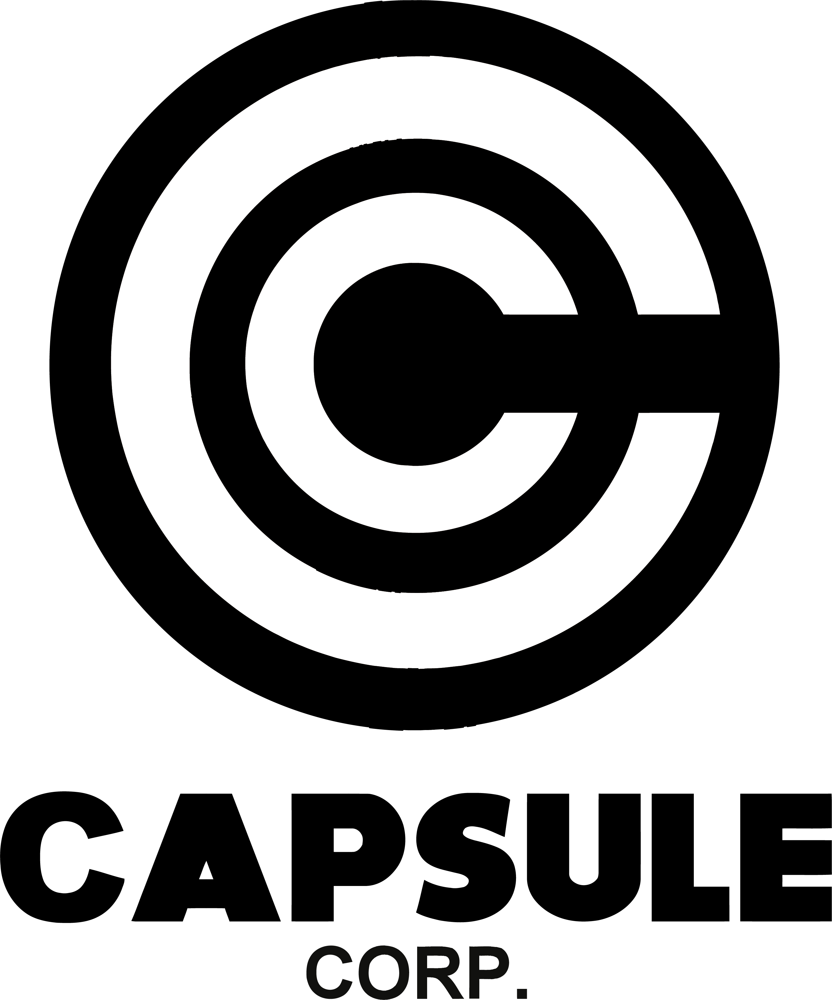

<div style="text-align:center;">
  
</div>

Welcome to the Capsule Corp project! This e-commerce website is based on the iconic Capsule Corp from the Dragon Ball series. It features a variety of products from the show, allowing you to shop for your favorite items from the Dragon Ball universe. This project is built using React, Vite, TypeScript, and incorporates various essential features and technologies.

## Table of Contents

- [Features](#features)
- [Technologies](#technologies)
- [Installation](#installation)
- [Usage](#usage)
- [Project Structure](#project-structure)
- [Contributing](#contributing)
- [License](#license)

## Features

This e-commerce project includes the following key features:

1. **Product Listings**: Browse and explore a wide range of products from the Dragon Ball series.

2. **Add to Cart**: Add your favorite products to your shopping cart.

3. **Wishlist**: Save products to your wishlist for future reference.

4. **Admin Login**: Secure admin login functionality for managing the products and orders.

5. **Private Routes**: Ensure that certain routes are only accessible by authenticated users (admin).

6. **.env**: Use environment variables to handle sensitive data or configuration settings securely.

7. **Custom Hooks**: Implement custom hooks to manage different aspects of the application.

8. **React Router**: Utilize React Router for navigation and dynamic routing.

9. **Context API**: Manage state and share data between components using React Context.

10. **Forms**: Use input forms for product searches, login, and user interactions.

11. **Async/Await**: Implement asynchronous operations for fetching and handling data.

12. **React Hook Form**: Employ the React Hook Form library for form handling and validation.

13. **Swiper.js**: Utilize Swiper.js to create responsive and interactive product carousels.

14. **React Hot Toaster**: Display informative and user-friendly toasts for various actions.

15. **Custom CSS**: Customize the styling of the application with your own CSS.

## Technologies

The project is built using the following technologies and libraries:

- **React**: A JavaScript library for building user interfaces.

- **Vite**: A fast, opinionated web development build tool for React and other front-end technologies.

- **TypeScript**: A typed superset of JavaScript that enhances code quality and developer productivity.

- **React Router**: For creating dynamic and private routes within the application.

- **JSON Server**: To simulate a backend server for managing product and order data.

- **Swiper.js**: A modern and responsive touch slider library for interactive product carousels.

- **React Hook Form**: A library for managing forms in React applications.

- **React Hot Toaster**: A library for displaying toast notifications.

- **React-Router-Dom**: For routing in React applications.

## Installation

To get started with this project, follow these steps:

1. Clone the repository:

   ```bash
   git clone https://github.com/antonyoandrei/capsule-corp.git
1. Change directory to the project folder:

   ```bash
   cd capsule-corp
1. Install dependencies:

   ```bash
   pnpm install

## Usage

To run the project, use the following commands:
1. Run JSON server:

   ```bash
   pnpm run server
1. Run the development server:

   ```bash
   pnpm run dev

## Project Structure

The project structure is organized as follows:

- **src**: Contains the source code of the application.
- **.env**: Includes both APIS fetched through the project.
- **components**: Reusable React components and their respective css file.
- **context**: Context providers and consumers.
- **pages**: React components for different pages and routes.
- **types**: Global interfaces used along different components.
- **css**: Global CSS styles.
- **db.json**: JSON file used as a mock database with JSON Server.
- **routes** and **private routes**: Files that allows the user to navigate dynamically and privately through the application.
- **fonts**: Imported fonts.