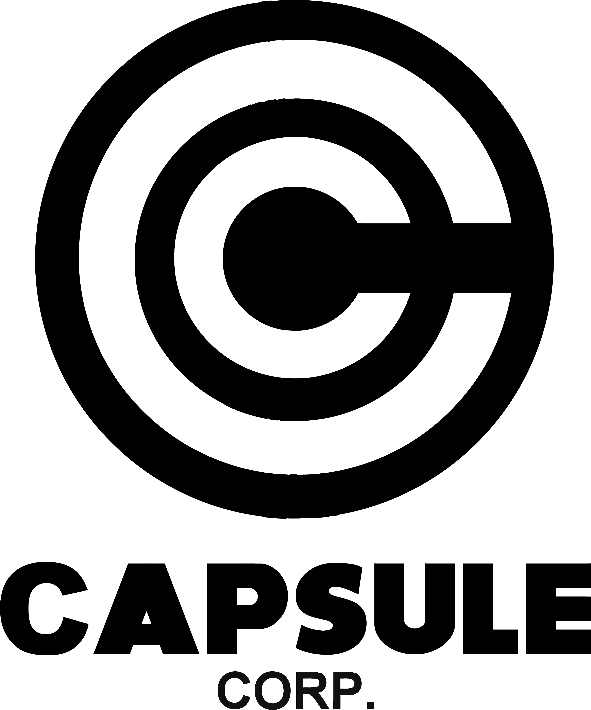

<div align="center">
  
  <h1>Capsule Corp Store</h1>
  <p>Catálogo responsive inspirado en el universo Dragon Ball, construido con React, TypeScript y Vite.</p>
</div>

## Demo

El acceso es una experiencia demo: introduce cualquier nombre de al menos dos caracteres. No se solicita contraseña ni se envían datos de autenticación a la API.

El recorrido principal incluye:

- catálogo de ropa y objetos;
- selección de productos más buscados;
- ficha de producto con galería;
- wishlist y carrito persistentes;
- checkout responsive con validación;
- estados de carga, error y contenido vacío.

## Screenshots

### Home · desktop


### Home · mobile


### Catálogo · hover desktop


### Login


## Stack

- React 18.3
- TypeScript 5.9
- Vite 6.4
- React Router 7.18
- React Hook Form 7.86
- Swiper 12.2
- React Hot Toast 2.6
- CSS responsive sin framework visual

## Requisitos

- Node.js 22 o superior
- pnpm 10 o superior
- API de Capsule Corp disponible en local o desplegada

## Ejecución local

La API y el frontend viven en repositorios separados. Con ambos directorios al mismo nivel:

```text
Capsule-Corp/
Capsule-Corp-Api/
```

Inicia primero la API:

```bash
cd ../Capsule-Corp-Api
npm install
npm start
```

La API quedará disponible en `http://localhost:3000`.

Después inicia el frontend:

```bash
cd ../Capsule-Corp
pnpm install
pnpm dev
```

Vite abrirá la aplicación en `http://localhost:5173` o en el siguiente puerto libre.

## Variables de entorno

Copia `.env.example` como `.env`:

```env
VITE_API_BASE_URL=http://localhost:3000
```

También se mantienen los endpoints específicos por compatibilidad:

```env
VITE_API_BASE_URL_CLOTHES=http://localhost:3000/clothes
VITE_API_BASE_URL_ITEMS=http://localhost:3000/items
```

`VITE_API_BASE_URL` es la opción recomendada. En producción debe apuntar al dominio desplegado de `Capsule-Corp-Api`.

## API

| Método | Endpoint | Descripción |
| --- | --- | --- |
| GET | `/health` | Estado y número total de productos |
| GET | `/clothes` | Colección de ropa |
| GET | `/items` | Colección de objetos |
| GET | `/clothes/:id` | Prenda por ID |
| GET | `/items/:id` | Objeto por ID |
| GET | `/api/clothes` | Alias preparado para despliegue |
| GET | `/api/items` | Alias preparado para despliegue |

Las colecciones aceptan `q`, `_page` y `_limit`.

## Calidad

```bash
pnpm run lint
pnpm run build
pnpm run preview
```

La API se valida con:

```bash
npm run check
npm audit
```

## Despliegue en Vercel

### API

1. Crea un proyecto de Vercel con `Capsule-Corp-Api` como directorio raíz.
2. Vercel detectará `api/server.js` y aplicará `vercel.json`.
3. Comprueba `https://tu-api.vercel.app/health`.

### Frontend

1. Crea otro proyecto con `Capsule-Corp` como directorio raíz.
2. Configura `VITE_API_BASE_URL=https://tu-api.vercel.app`.
3. Usa `pnpm run build` y `dist` como directorio de salida.
4. `vercel.json` mantiene las rutas de React Router al recargar o abrir una URL directa.

## Persistencia

La sesión demo, la wishlist y el carrito se guardan en `localStorage`. La API es pública y de solo lectura; el checkout simula una orden y no procesa pagos ni almacena datos personales.
